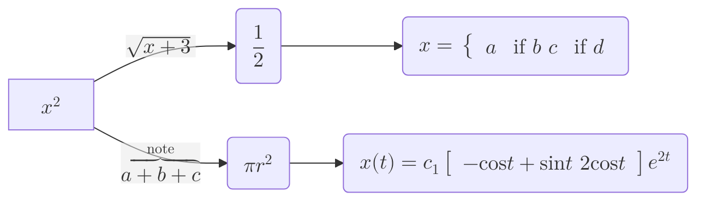
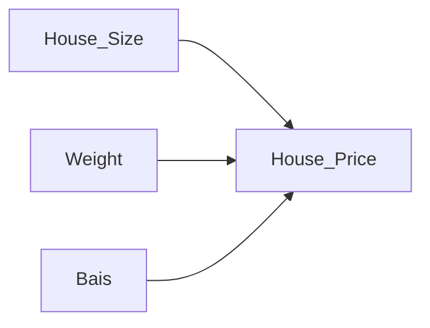

<style>
pre {
    font-family: monospace;
}
</style>

A comparison table between **Conda** and **Poetry**:

| Feature            | **Conda**  | **Poetry**  |
|--------------------|-----------|------------|
| **Primary Purpose** | Manages Python **environments** and **packages** | Manages Python **dependencies** and **packaging** |
| **Python Version Management** | ✅ Yes, can install/manage multiple Python versions | ❌ No, relies on system or `pyenv` |
| **Package Management** | ✅ Yes, manages both Python & non-Python dependencies | ✅ Yes, but only Python dependencies |
| **Dependency Resolution** | 🔵 Fast (uses pre-built binaries) | 🟡 Slower than Conda, but still efficient |
| **Virtual Environment Support** | ✅ Yes (creates isolated environments) | ✅ Yes (creates `.venv` inside project) |
| **Installation Source** | Conda repositories (`conda-forge`, `defaults`) | PyPI (`poetry.lock`, `pyproject.toml`) |
| **Speed** | ⚡ Fast (uses pre-compiled packages) | 🟡 Slower (builds packages from source) |
| **Ease of Use** | 🟡 Slightly complex, requires `conda` CLI | ✅ Simple, with a modern `poetry` CLI |
| **Cross-Platform** | ✅ Yes (Windows, Mac, Linux) | ✅ Yes (Windows, Mac, Linux) |
| **Support for Non-Python Dependencies** | ✅ Yes (e.g., BLAS, CUDA, R) | ❌ No, Python packages only |
| **Environment Reproducibility** | ✅ `environment.yml` | ✅ `poetry.lock` ensures consistency |
| **Works Well With PyPI?** | ❌ No (uses its own package index) | ✅ Yes (designed for PyPI) |
| **Best For** | Data science, ML, scientific computing | General Python projects, package distribution |

### **Which One Should You Use?**
- **Use Conda** if you need **both Python and non-Python dependencies** (e.g., NumPy, TensorFlow, OpenCV).
- **Use Poetry** if you are developing **Python applications** and need **better dependency management** for PyPI-based projects.


## Official links to Visual Studio Build Tools:
- **Visual Studio 2017 Build Tools: https://aka.ms/vs/15/release/vs_buildtools.exe**
- **Visual Studio 2019 Build Tools: https://aka.ms/vs/16/release/vs_buildtools.exe**
- **Visual Studio 2022 Build Tools: https://aka.ms/vs/17/release/vs_buildtools.exe**


## 01 How to Install Poetry with pyenv: Simplify Python Dependency Management | Poetry vs Anaconda
[Poetry install](https://www.youtube.com/watch?v=0bBfPCWt61U)


The linear regression model can be expressed as:

$$
y = w \cdot x + b
$$

where:
- \( y \) is the predicted output,
- \( x \) is the input feature,
- \( w \) is the weight (coefficient) associated with the input feature,
- \( b \) is the bias (intercept) term.




$$I = \int_a^b f(x) dx$$


# Linear Regression Iterations

## Iteration 1
```
Price ($)
600K |                                            *
     |                                      *
500K |                                *     /
     |                          *     /
400K |                    *     /
     |              *     /
300K |        *     /
     |  *     /
200K |    /
     |/
  0  +-----+-----+-----+-----+-----+-----+-----+
     1000  1500  2000  2500  3000  3500  4000 Size (sq ft)

* = Data points
/ = First regression line (poor fit)
```

## Iteration 2
```
Price ($)
600K |                                            *
     |                                      *   /
500K |                                *    /
     |                          *    /
400K |                    *    /
     |              *    /
300K |        *    /
     |  *    /
200K |   /
     |/
  0  +-----+-----+-----+-----+-----+-----+-----+
     1000  1500  2000  2500  3000  3500  4000 Size (sq ft)

* = Data points
/ = Second regression line (better fit)
```

## Iteration 3
```
Price ($)
600K |                                            *
     |                                      *  /
500K |                                *   /
     |                          *   /
400K |                    *   /
     |              *   /
300K |        *   /
     |  *   /
200K |  /
     |/
  0  +-----+-----+-----+-----+-----+-----+-----+
     1000  1500  2000  2500  3000  3500  4000 Size (sq ft)

* = Data points
/ = Third regression line (even better fit)
```

## Final Iteration
```
Price ($)
600K |                                            *
     |                                      */
500K |                                *  /
     |                          *  /
400K |                    *  /
     |              *  /
300K |        *  /
     |  *  /
200K |/
     |
  0  +-----+-----+-----+-----+-----+-----+-----+
     1000  1500  2000  2500  3000  3500  4000 Size (sq ft)

* = Data points
/ = Final regression line (best fit)
```