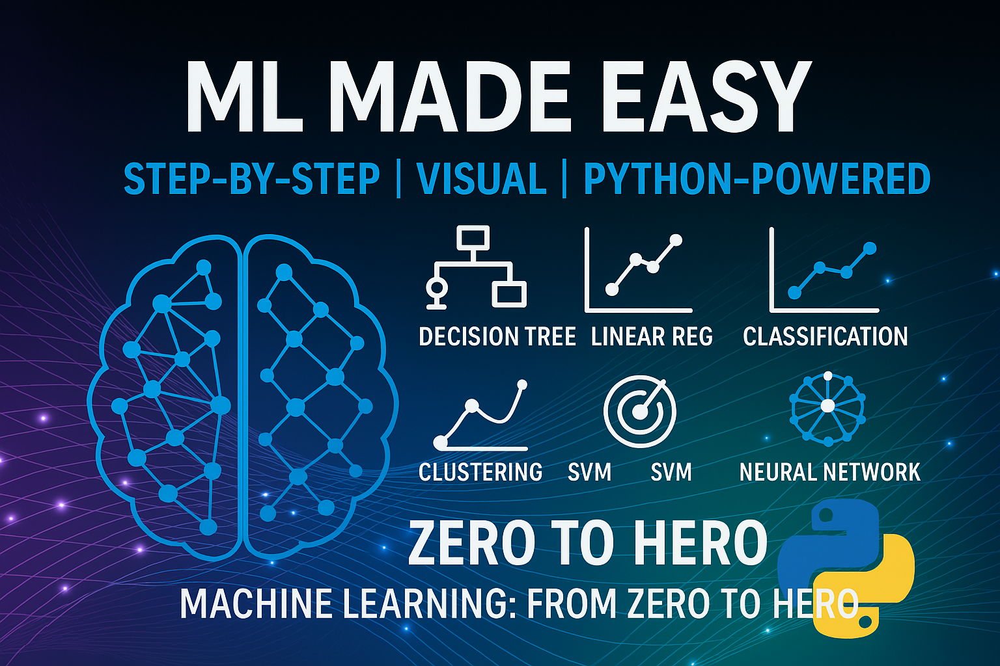
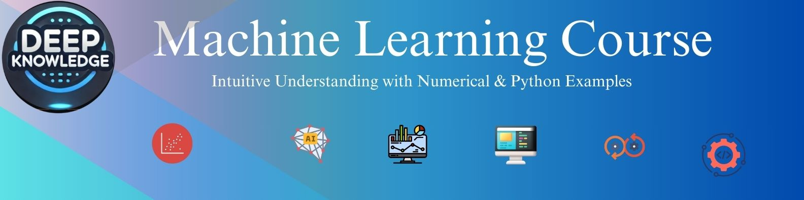

# **🚀 Machine Learning Course: Intuitive Understanding with Numerical & Python Examples**

<!-- <center>


</center> -->

<center>

</center>


Welcome to the **Machine Learning Course**! This repository is designed to provide an intuitive understanding of machine learning concepts, supported by **numerical examples**, **Python implementations**, and **dedicated videos** for every topic. Whether you're a beginner or an experienced practitioner, this course has something for you!

# Machine Learning Course

[](https://www.python.org/)
[](https://pendulum.eustace.io/)
[](https://numpy.org/)
[](https://docs.python-requests.org/)
[](https://matplotlib.org/)
[](https://pandas.pydata.org/)
[](https://scikit-learn.org/)
[](https://lightgbm.readthedocs.io/)
[](https://pyyaml.org/)
[](https://mlflow.org/)
[](https://opensource.org/licenses/MIT)
<!-- [](https://github.com/DeepKnowledge1/ml)  
[](https://www.youtube.com/playlist?list=PL-kVqysGX5179csIx8Ujesglg6tNll9LI)  
[](https://numpy.org/) -->
<!-- []()
[]()
[]()
[]() -->
[]()

---

## **🌟 Why This Course?**
- **Hands-on Learning**: Every concept is explained with Python code and real-world examples.  
- **Video Support**: Each topic has a dedicated YouTube video for intuitive understanding.  
- **Beginner-Friendly**: No prior knowledge required—start from scratch and become an expert.  
- **Comprehensive Coverage**: From basics to advanced topics like Deep Learning and Computer Vision.  

---

## **📚 Table of Contents**
1. [**Part I: Foundations**](#-part-i-foundations)
2. [**Part II: Core Machine Learning Concepts**](#-part-ii-core-machine-learning-concepts)
3. [**Part III: Advanced Machine Learning**](#-part-iii-advanced-machine-learning)
4. [**Part IV: Deep Learning**](#-part-iv-deep-learning)
5. [**Part V: Practical Applications**](#-part-v-practical-applications)
6. [**Course Conclusion**](#-course-conclusion)

---

## **🟢 Part I: Foundations**

### **1️⃣ Introduction to Machine Learning**
📌 **Core Concepts**  
- **What is Machine Learning?**  
- **Types of Machine Learning**:  
  ✅ **Supervised Learning**  
  ✅ **Unsupervised Learning**  
  ✅ **Reinforcement Learning**  
- **Real-world Applications**  
  [🎥 Watch Video](https://youtu.be/AzSS9pQ1lxI) | [💻 Code Example]("")  

📌 **Development Environment Setup**  
- **Python Configuration**   
- **Jupyter Notebooks**   
- **Essential Libraries**  
  [🎥 Watch Video](https://youtu.be/vlr3lvD63Ms) | [💻 Code Example](pyproject.toml)  

---

## **🟡 Part II: Core Machine Learning Concepts**

### **2️⃣ Supervised Learning: Regression**
📌 **Fundamentals of Regression**  
- **Linear Regression**  
  ✅ **Step-by-step Weight Computation**      
  ✅ **Implementation with pure `python` and `gradient descent`**  
    [🎥 Watch Video](https://youtu.be/86TI5FpVF2g) | [💻 Code Example](Supervised_Learning/Linear_Regression/linear_regression.py)  
- **Multiple Linear Regression**  
  [🎥 Watch Video](https://youtu.be/98FIO2Xqwxs) | [💻 Code Example](Supervised_Learning/Linear_Regression/linear_regression.py)  
- **Polynomial Regression**  
  [🎥 Watch Video](https://youtu.be/4ofxKXCT1MU) | [💻 Code Example](Supervised_Learning/Linear_Regression/Polynomial_Regression.py)  

📌 **Performance Metrics**  
- **RMSE and MAE Calculations**  
- **R² Score Implementation**  
- **Evaluation using `sklearn.metrics`**  
  [🎥 Watch Video](https://youtu.be/l0yfMiCXs4c) | [💻 Code Example](Supervised_Learning/Linear_Regression/metrics.py)  

📌 **Regularization**  
- **L1 (Lasso)**  
- [🎥 Watch Video](https://youtu.be/hUYk8GWAJ1U) | [💻 Code Example](Supervised_Learning/Linear_Regression/regulaziation_L1.py)  
- **L2 (Ridge)**  
  [🎥 Watch Video](https://youtu.be/hUYk8GWAJ1U) | [💻 Code Example](Supervised_Learning/Linear_Regression/regularization_L2.py)  

---

### **3️⃣ Supervised Learning: Classification**
📌 **Popular Classification Algorithms**  
- **Logistic Regression**  
  [🎥 Watch Video](https://youtu.be/brG45QGmrVA) | [💻 Code Example](Supervised_Learning/Logistic_Regression/main.py)  
- **Decision Trees**  
  [🎥 Watch Video](https://youtu.be/qZRdB4KU6LA) | [💻 Code Example](Supervised_Learning/Decision_Tree/main.py)  
- **Naïve Bayes**  
  [🎥 Watch Video](https://youtu.be/pkWiyhw7VZk) | [💻 Code Example](Supervised_Learning/Naive_Bayes/main.py)  
- **Support Vector Machines (SVM)**  
  [🎥 Watch Video](https://youtu.be/4IWW_n7OQLw) | [💻 Code Example](Supervised_Learning/Support_Vector_Machine/main.py)  
- **SVM Multi class**  
  [🎥 Watch Video](https://youtu.be/azfIj_OdOuE) | [💻 Code Example](Supervised_Learning/Support_Vector_Machine/main.py)  
- **K-Nearest Neighbors (KNN)**  
  [🎥 Watch Video](https://youtu.be/DpmLo5prSMc) | [💻 Code Example](Supervised_Learning/KNN/main.py)  

📌 **Performance Metrics for Classification**  
- **Confusion Matrix Analysis, Precision, Recall, and F1-Score**  
  [🎥 Watch Video](https://youtu.be/xAfL5DXNAGM) | [💻 Code Example](Supervised_Learning/classification_metrics.py)  
- **ROC Curve and AUC in Binary Classification**  
  [🎥 Watch Video](https://youtu.be/TJqHR-va91U) | [💻 Code Example](Supervised_Learning/classification_projects/BaseClassifier.py)  

📌 **Classification Projects**  
- **Binary Classification Project: Spam email**  
  [🎥 Watch Video](https://youtu.be/UfpsQp1cTww) | [💻 Code Example](Supervised_Learning/classification_projects/main.py)  
- **Multi class Classification Project**  
  [🎥 Watch Video](https://youtu.be/RqelaHU9I8Q) | [💻 Code Example](Supervised_Learning/classification_projects/main.py)  
---

---

### **4️⃣ Unsupervised Learning**
📌 **Clustering Techniques**  
- **K-Means Clustering**  
  [🎥 Watch Video](https://youtu.be/RqelaHU9I8Q) | [💻 Code Example](Unsupervised_Learning/K-Means/main.py)  | [💻 Code optimal K](Unsupervised_Learning/K-Means/optimal_K.py)  
- **Hierarchical Clustering**  
  [🎥 Watch Video](https://youtu.be/EzIs_nhT8pU) | [💻 Code Example](Unsupervised_Learning/Hierarchical_clustering/main.py)  

📌 **Dimensionality Reduction**  
- **Principal Component Analysis (PCA)**  
  [🎥 Watch Video](https://youtu.be/EzIs_nhT8pU) | [💻 Code Example](Unsupervised_Learning/PCA/main.py)  
- **Incremental Principal Component Analysis (PCA)**  
  [🎥 Watch Video](https://youtu.be/sP7YogwJERs) | [💻 Code Example](Unsupervised_Learning/PCA/increamental_pca.py)  

📌 **Clustering Performance Metrics**  
- **Silhouette Score**  
  [🎥 Watch Video](https://youtu.be/ENc-dkwibEs) | [💻 Code Example](Unsupervised_Learning/clustering_mettrics.py)  
- **Inertia Calculation**  
  [🎥 Watch Video](Not Yet) | [💻 Code Example](In progress)  
- **Cluster Evaluation Methods**  
  [🎥 Watch Video](Not Yet) | [💻 Code Example](In progress)  

---
---

## **🔵 Part III: Advanced Machine Learning**

### **5️⃣ Ensemble Methods**
📌 **Combining Multiple Models for Higher Accuracy**  
- **Random Forest**  
  [🎥 Watch Video](Not Yet) | [💻 Code Example](In progress)  
- **Boosting Algorithms**  
  ✅ **AdaBoost**  
    [🎥 Watch Video](Not Yet) | [💻 Code Example](In progress)  
  ✅ **Gradient Boosting**  
    [🎥 Watch Video](Not Yet) | [💻 Code Example](In progress)  
  ✅ **XGBoost**  
    [🎥 Watch Video](Not Yet) | [💻 Code Example](In progress)  

---

### **6️⃣ Model Optimization**
📌 **Hyperparameter Tuning**  
- **Grid Search**  
  [🎥 Watch Video](Not Yet) | [💻 Code Example](In progress)  
- **Random Search**  
  [🎥 Watch Video](Not Yet) | [💻 Code Example](In progress)  

📌 **Cross-Validation Techniques**  
  [🎥 Watch Video](Not Yet) | [💻 Code Example](In progress)  

---

## **🟣 Part IV: Deep Learning**
### **7️⃣ Neural Networks Fundamentals**
📌 **Neural Network Basics**  
- Neural Network Architecture  
  ✅ Forward Propagation Examples  
  ✅ TensorFlow Implementation  
- Backpropagation    
[🎥 Watch Video](Not Yet) | [💻 Code Example](In progress)  


📌 **Performance Measurement**  
- Loss Functions
- Accuracy Metrics  
- Implementation with PyTorch  
[🎥 Watch Video](Not Yet) | [💻 Code Example](In progress)  


---

### **8️⃣ Convolutional Neural Networks (CNNs)**
📌 **CNN Architecture**  
  [🎥 Watch Video](Not Yet) | [💻 Code Example](In progress)  

- **Convolutional Layers**  
  [🎥 Watch Video](Not Yet) | [💻 Code Example](In progress)  

- **Filters/Kernels**  
  [🎥 Watch Video](Not Yet) | [💻 Code Example](In progress)  

- **Stride & Padding**   
  [🎥 Watch Video](Not Yet) | [💻 Code Example](In progress)  

- **Activation Functions**   
  [🎥 Watch Video](Not Yet) | [💻 Code Example](In progress)  

- **Pooling Layers**  
  [🎥 Watch Video](Not Yet) | [💻 Code Example](In progress)  

- **Fully Connected Layers**  
  [🎥 Watch Video](Not Yet) | [💻 Code Example](In progress)  

- **Dropout & Batch Normalization**  
  [🎥 Watch Video](Not Yet) | [💻 Code Example](In progress)  

- **Backpropagation & Optimization**   
  [🎥 Watch Video](Not Yet) | [💻 Code Example](In progress)  

- **Feature Maps**  
  [🎥 Watch Video](Not Yet) | [💻 Code Example](In progress)  

- **Transfer Learning**    
    [🎥 Watch Video](Not Yet) | [💻 Code Example](In progress)  

      
📌 **Practical Implementations**  
- Image Classification  
- **YOLO Object Detection**  
  ✅ YOLO Architecture  
  ✅ YOLOv5 Implementation  
  ✅ Real-time Detection  


## **🟠 Part V: Practical Applications**

### **9️⃣ Real-World Projects**
📌 **Hands-on Learning with Real Data**  
- **Regression Project: House Price Prediction**  
  [🎥 Watch Video](Not Yet) | [💻 Code Example](In progress)  
- **Classification Project: Email Spam Detection**  
  [🎥 Watch Video](Not Yet) | [💻 Code Example](In progress)  
- **Clustering Project: Customer Segmentation**  
  [🎥 Watch Video](Not Yet) | [💻 Code Example](In progress)  
- **Computer Vision Project: Object Detection**  
  [🎥 Watch Video](Not Yet) | [💻 Code Example](In progress)  

---

## **🔟 Course Conclusion**

📌 **Final Takeaways**  
- **Key Concepts Review**  
  [🎥 Watch Video](Not Yet) | [💻 Code Example](In progress)  
- **Machine Learning Best Practices**  
  [🎥 Watch Video](Not Yet) | [💻 Code Example](In progress)  
- **Advanced Learning Pathways**  
  [🎥 Watch Video](Not Yet) | [💻 Code Example](In progress)  

---


## **📝 How to Use This Repository**
1. Clone the repository:
   ```bash
   git clone https://github.com/DeepKnowledge1/ml.git
   ```
2. Install dependencies:
   ```bash
   poetry shell
   poetry install
   ```
3. Explore the notebooks and code examples for each topic.

---

## **📧 Contact**
For questions or feedback, feel free to reach out:  
📩 **Email**: deepp.knowldge@gmail.com  
🌐 **YouTube**: [Deep Knowldge](https://www.youtube.com/playlist?list=PL-kVqysGX5179csIx8Ujesglg6tNll9LI)  
🐦 **GitHub**: [@YourHandle](https://github.com/DeepKnowledge1/ml)

---

## **📜 License**
This project is licensed under the MIT License. See the [LICENSE](LICENSE) file for details.

---

Enjoy learning Machine Learning! 🚀
